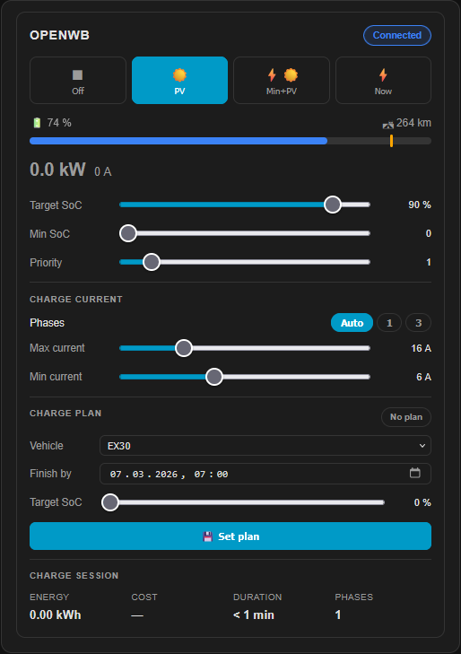
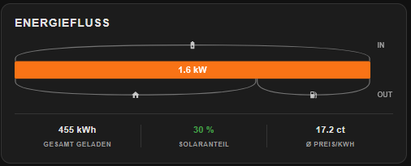
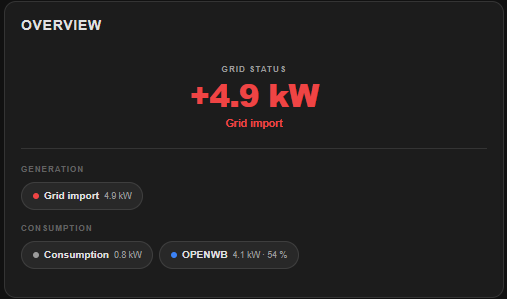
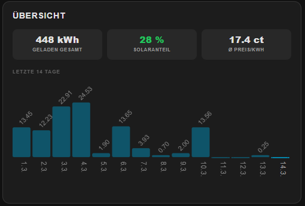
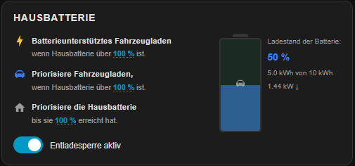
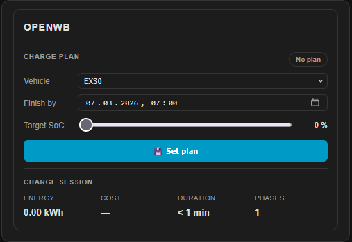
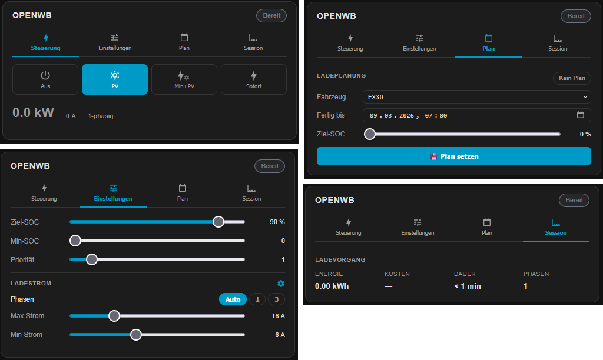

# EVCC Card for Home Assistant

[](https://github.com/hacs/integration) [](LICENSE) [](https://github.com/mkshb/hass-evcc-card/actions/workflows/validate.yaml) <!-- LANGUAGES_START --><!-- LANGUAGES_END --> [](https://github.com/mkshb/hass-evcc-card/stargazers) [](https://github.com/mkshb/hass-evcc-card/commits/main) [](https://github.com/mkshb/hass-evcc-card/issues)

A custom Lovelace card for [Home Assistant](https://www.home-assistant.io/) that provides a comprehensive dashboard for [EVCC](https://evcc.io/) — the open-source EV charging controller — using the [ha-evcc integration](https://github.com/marq24/ha-evcc).

All charge points and site entities are **automatically discovered** based on the integration's entity naming scheme — no manual entity mapping required.

---

## Modes

| Mode | Description |
|---|---|
| ⚡ `loadpoint` | Main charge point view — mode buttons, SoC bar, session, sliders, phase switch, charge plan |
| ☀️ `site` | Full site energy overview — PV bar, individual strings, live In/Out table with battery & charge point details |
| 🔌 `grid` | Compact grid focus — large net value with color coding, solar share badge, source and consumer chips |
| 📈 `stats` | Charging statistics — KPIs with period selector (30d / 365d / this year / total) and solar trend bar chart |
| 🏠 `battery` | Home battery block — SoC indicator, buffer & priority sliders, discharge lock |
| 📑 `compact` | Tab layout of `loadpoint` — Control / Settings / Plan / Session, ideal for space-constrained dashboards |
| 📋 `plan` | Minimalist charge plan only — vehicle selector, target time & SoC, activate / delete |

## General Features

| Feature | Description |
|---|---|
| 🔍 **Auto-discovery** | Automatically detects all charge points and site entities — zero manual configuration |
| 🔄 **Live updates** | Power, SoC and status update in real time without full re-render |
| 🔋 **SoC display** | Vehicle state of charge as a progress bar with percentage and estimated range |
| 🎚️ **Slider controls** | Adjust Target SoC, Min SoC, Priority, Max current and Min current inline |
| 🔌 **Phase switching** | Auto / 1-phase / 3-phase control built in |
| 🌍 **Multi-language** | Support for various languages — auto-detected from HA language setting, easily extensible |
| 🎛️ **Filtering** | Select specific charge points via `loadpoints` config |

---

## Prerequisites

- [Home Assistant](https://www.home-assistant.io/) (2023.x or newer)
- [ha-evcc integration](https://github.com/marq24/ha-evcc) installed and configured
- A running [EVCC](https://evcc.io/) instance connected to Home Assistant

---

## Installation

### Via HACS (recommended)

1. Open **HACS** in Home Assistant
2. Click the three-dot menu (top right) → **Custom repositories**
3. Add this repository URL (https://github.com/mkshb/hass-evcc-card.git) and select category **Dashboard**
4. Search for **EVCC Card** and click **Install**
5. Reload your browser

> **Note for YAML mode users:** If your Lovelace is configured with `mode: yaml` in `configuration.yaml`, HACS cannot register the resource automatically. Add the resource entry manually — see [Manual resource registration](#manual-resource-registration) below.

### Manual installation

1. Download `evcc-card.js` and the `locales/` folder from the [latest release](../../releases/latest)
2. Copy them to `config/www/hass-evcc-card/` in your Home Assistant instance, preserving the folder structure:

```
config/www/hass-evcc-card/
├── evcc-card.js
└── locales/
    ├── index.json
    └── *.json
```

3. Register the resource — see [Manual resource registration](#manual-resource-registration) below.
4. Reload your browser

### Manual resource registration

Depending on how your Lovelace is set up, register the resource in one of two ways:

**UI mode** (default): Go to **Settings → Dashboards → ⋮ → Resources** and add:

```yaml
url: /hacsfiles/hass-evcc-card/evcc-card.js  # if installed via HACS
# or
url: /local/hass-evcc-card/evcc-card.js       # if installed manually
type: module
```

**YAML mode** (`lovelace_mode: yaml` in `configuration.yaml`): Add the resource to your Lovelace YAML configuration file (typically `ui-lovelace.yaml` or referenced via `lovelace: !include`):

```yaml
resources:
  - url: /hacsfiles/hass-evcc-card/evcc-card.js   # if installed via HACS
    type: module
  # or
  - url: /local/hass-evcc-card/evcc-card.js       # if installed manually
    type: module
```

Then restart Home Assistant or reload the Lovelace resources.

---

## Configuration & Modes

Add the card to any Lovelace dashboard using the YAML editor. The `mode` option controls what the card displays.

### Configuration options

| Option | Type | Default | Description |
|---|---|---|---|
| `mode` | `string` | `loadpoint` | Card mode: `loadpoint`, `compact`, `battery`, `site`, `grid`, `stats`, `plan` |
| `loadpoints` | `list` | *(all)* | Filter charge points by name |
| `language` | `string` | *(auto)* | Override UI language. Examples: `de`, `en`, `es`, `hr`, `nl` |
| `no_plan` | `list` | *(none)* | Hide charge plan block for specific charge points |
| `site_details` | `string` | *(expanded)* | Set to `collapsed` to hide the IN/OUT detail table by default in `site` mode |
| `charge_current_settings` | `string` | *(collapsed)* | Set to `expanded` to show the charge current block (phase switch, min/max current) expanded by default |
| `prefix` | `string` | `evcc_` | Entity name prefix used by the integration — only needed if you run multiple EVCC instances with a custom prefix (e.g. `evcc2_`) |
| `stats_period` | `string` | `total` | Statistics period shown in the footer of `site` and `grid` cards. Allowed values: `total`, `30d`, `365d`, `thisYear`. The `stats` card always shows an interactive tab selector regardless of this option. |

---

### `loadpoint` (default)

The main charge point view. For each discovered charge point it shows:

- Charge mode buttons (Off / PV / Min+PV / Now)
- Vehicle SoC progress bar with percentage and estimated range
- Current charging session: energy, cost, duration, phases
- Sliders: Target SoC, Min SoC, Priority SoC, Min current, Max current
- Phase switch: Auto / 1-phase / 3-phase
- Charge plan block

The **CHARGE CURRENT** section (phase switch, max current, min current) is collapsed by default and can be toggled at any time using the ⚙️ gear icon next to the section title. Use `charge_current_settings: expanded` to start it expanded instead.

```yaml
type: custom:evcc-card
```

```yaml
type: custom:evcc-card
loadpoints:
  - openwb          # show only specific charge points by name
  - wallbox-garage
```

```yaml
type: custom:evcc-card
charge_current_settings: expanded   # show charge current block expanded by default
```

```yaml
type: custom:evcc-card
no_plan:
  - wallbox-garage   # hide the charge plan block for this charge point
```



---

### `site`

Full site energy overview:

- PV production bar split into: home consumption / charging / battery / feed-in
- Individual PV string values (e.g. BKW, Dach) shown as indented sub-rows
- Live power table with IN/OUT sections: Grid import/export, PV generation, home consumption, charging, battery
- Battery SoC shown inline in the charging/discharging row (e.g. `Battery charging – 47 %`)
- Active charge points shown as indented sub-rows under the charging row, including vehicle SoC or temperature

The IN/OUT detail table can be toggled by clicking the power bar. It opens expanded by default; use `site_details: collapsed` to start collapsed instead.

```yaml
type: custom:evcc-card
mode: site
```

```yaml
type: custom:evcc-card
mode: site
site_details: collapsed   # start with the detail table hidden
```



---

### `grid`

Compact site energy overview with a focus on the current grid status:

- Large net grid value with color coding: red for import, green for export
- Solar self-sufficiency badge (e.g. `86 % Solar`) shown when PV is active
- Source chips: active energy sources (PV generation, grid import, battery discharge)
- Consumer chips: active consumers (home consumption, charge points with vehicle SoC/temperature, battery charging, grid export)

```yaml
type: custom:evcc-card
mode: grid
```



> **⚠️ Deprecation notice:** `mode: site2` still works but is deprecated and will be removed in a future release. Please migrate to `mode: grid`.

---

### `stats`

Charging statistics with period selector and a matching bar chart:

- **Period tabs:** 30 days · 365 days · This year · Total — switch with a single tap; the selection is remembered for the session
- Three KPIs per period: charged energy (kWh), solar share (%), average price (ct/kWh)
- The bar chart adapts to the selected period:

| Tab | Chart | Bars |
|---|---|---|
| **30 days** | Daily values | 30 bars (day.month labels) |
| **365 days** | Rolling monthly | 13 bars (3-letter month labels) |
| **This year** | Monthly, current calendar year | Jan – current month |
| **Total** | One bar per year | All available years |

- Chart data is fetched lazily per tab on first access and cached for 5 minutes
- The same three KPIs also appear as a compact footer row at the bottom of `site` and `grid` cards — the period shown there is controlled via the `stats_period` config option (default: `total`)

The stat entities are auto-discovered using the pattern `sensor.{prefix}stat_*` (e.g. `sensor.evcc_stat_total_charged_kwh`). The bar chart always uses the cumulative `sensor.{prefix}stat_total_charged_kwh` entity from the HA Recorder, independent of which KPI period is selected.

> **ℹ️ Note:** The **Total** period is enabled by default in ha-evcc. The periods **30 days**, **365 days** and **This year** must be **manually enabled** in the ha-evcc integration settings (Settings → Devices & Services → ha-evcc → Configure). If a period is not yet activated, the card shows a hint with instructions directly inside the card.

> **ℹ️ Single-year fallback:** If the **Total** tab detects that only one calendar year of data is available in the HA Recorder, it automatically falls back to showing the monthly breakdown of the current year — identical to the **This year** chart.

```yaml
type: custom:evcc-card
mode: stats
```


---

### `battery`

Home battery management block:

- Current battery SoC with visual indicator
- Buffer SoC slider
- Priority SoC slider
- Discharge lock toggle

```yaml
type: custom:evcc-card
mode: battery
```



---

### `plan`

Minimalist charge plan view:

- Vehicle selector
- Target time picker
- Target SoC slider
- Activate / delete plan

```yaml
type: custom:evcc-card
mode: plan
loadpoints:
  - openwb
```



---

### `compact`

Same content as `loadpoint`, but organized into four tabs — ideal for dashboards where vertical space is limited or multiple charge points are shown side by side:

| Tab | Contents |
|---|---|
| ⚡ **Control** | Charge mode buttons, vehicle SoC bar, current charging power |
| 🎚️ **Settings** | Target SoC, Min SoC, Priority sliders, current limits, phase switch |
| 📅 **Plan** | Charge plan: vehicle selector, target time, target SoC, activate/delete |
| 📊 **Session** | Energy, cost, duration and phases of the current session |

The selected tab is remembered per charge point across re-renders.

```yaml
type: custom:evcc-card
mode: compact
```

```yaml
type: custom:evcc-card
mode: compact
loadpoints:
  - openwb          # show only specific charge points by name
  - wallbox-garage
```



---

### Override language

<!-- LANGUAGES_START -->

<!-- LANGUAGES_END -->

```yaml
type: custom:evcc-card
language: en   # or other available language
```

---

## Icons

All icons throughout the card use inline [Material Design Icons](https://pictogrammers.com/library/mdi/) (MDI) rendered as embedded SVG paths — no external icon font, no `ha-icon` dependency, no `foreignObject`. This ensures correct rendering in all HA themes and browsers.

Key icon assignments:

| Element | Icon |
|---|---|
| PV generation | `mdi:white-balance-sunny` |
| PV sub-source (string) | `mdi:solar-panel` |
| Battery | `mdi:battery-charging-50` |
| Grid import / export | `mdi:transmission-tower` |
| Home consumption | `mdi:home` |
| Charge point | `mdi:ev-station` |
| Heat pump (°C loadpoint) | `mdi:thermometer-low` |
| Mode: Off | `mdi:power` |
| Mode: PV | `mdi:white-balance-sunny` |
| Mode: Min+PV | `mdi:lightning-bolt` & `mdi:white-balance-sunny` (combined) |
| Mode: Now | `mdi:lightning-bolt` |

---

## Translations

<!-- LANGUAGES_START -->

<!-- LANGUAGES_END -->

The card ships with multiple languages and automatically uses the language configured in Home Assistant. You can override it per card via the `language` config option.

Translations are stored as simple JSON files in the `dist/locales/` folder. Adding a new language takes only two steps:

1. Create a new file `dist/locales/<lang>.json` by copying an existing one (e.g. `en.json`) and translating the values
2. Add the language code to `dist/locales/index.json`

```json
["de", "en", "es", "fr", "hr", "nl", "pl", "pt"]
```

That's it — no changes to `evcc-card.js` required.

**Want to contribute a translation?** Pull requests for new languages are very welcome! Have a look at [`dist/locales/en.json`](dist/locales/en.json) as a starting point and open a PR with your new language file.

---

## Entity naming scheme

This card relies on the entity naming convention used by [ha-evcc](https://github.com/marq24/ha-evcc). Entities follow the pattern:

```
sensor.evcc_<loadpoint_name>_<entity_type>
select.evcc_<loadpoint_name>_mode
number.evcc_<loadpoint_name>_limit_soc
...
```

As long as you use the standard ha-evcc integration, no additional configuration is needed — the card discovers all entities automatically.

If you run **multiple EVCC instances** and your integration uses a custom prefix (e.g. `evcc2_`), set the `prefix` option accordingly:

```yaml
type: custom:evcc-card
prefix: evcc2_
```

---

## Contributing

Pull requests are welcome! Please open an issue first to discuss what you'd like to change.

1. Fork the repository
2. Create a feature branch: `git checkout -b feature/my-feature`
3. Commit your changes: `git commit -m 'Add my feature'`
4. Push to the branch: `git push origin feature/my-feature`
5. Open a Pull Request

Contributions that are especially appreciated:

- 🌍 **New translations** — see the [Translations](#translations) section above
- 🐛 **Bug reports and fixes**
- 💡 **Feature suggestions and implementations**

---

## License

[MIT](LICENSE)

---

## Video

[](https://www.youtube.com/watch?v=nQyiFg1RPy8)

The card was featured in a YouTube video — showing installation, configuration and usage in practice. Note: the video is in **German**.

---

## Related projects

- [EVCC](https://evcc.io/) — the EV charging controller this card is built for
- [ha-evcc](https://github.com/marq24/ha-evcc) — the Home Assistant integration providing all entities