# EVCC Card for Home Assistant

[](https://github.com/hacs/integration) [](LICENSE) [](https://github.com/mkshb/hass-evcc-card/actions/workflows/validate.yaml) <!-- LANGUAGES_START --><!-- LANGUAGES_END --> [](https://github.com/mkshb/hass-evcc-card/stargazers) [](https://github.com/mkshb/hass-evcc-card/commits/main) [](https://github.com/mkshb/hass-evcc-card/issues)

A custom Lovelace card for [Home Assistant](https://www.home-assistant.io/) that provides a comprehensive dashboard for [EVCC](https://evcc.io/) - the open-source EV charging controller - using the [ha-evcc integration](https://github.com/marq24/ha-evcc).

All charge points and site entities are **automatically discovered** via the HA entity registry - no manual entity mapping required. Starting with v0.5.0, the card includes a **native visual editor** - just add the card and configure everything interactively.

---

## Screenshots

<table>
<tr>
<td align="center"><b>Charge Point</b></td>
<td align="center"><b>Site</b></td>
<td align="center"><b>Flow</b></td>
<td align="center"><b>Grid</b></td>
</tr>
<tr>
<td>
<a href="#loadpoint-default">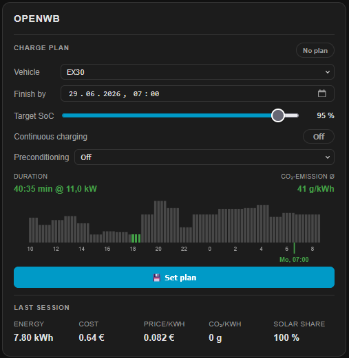</a>
<a href="#loadpoint-default">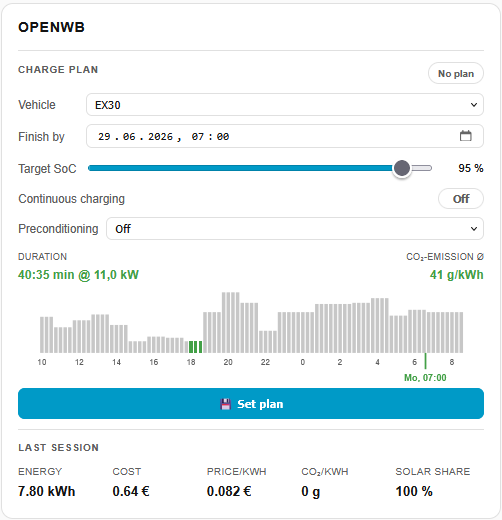</a>
</td>
<td>
<a href="#site">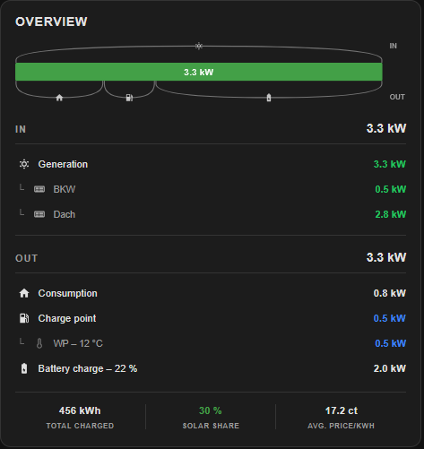</a>
<a href="#site">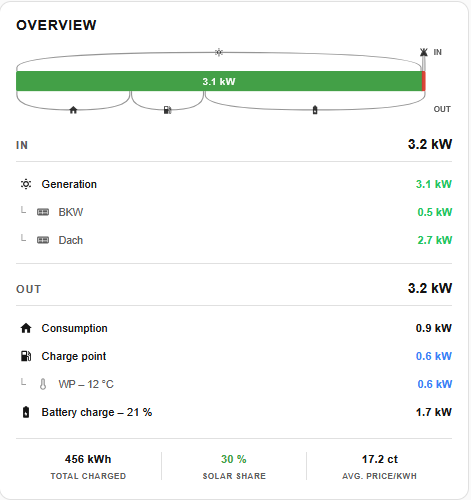</a>
</td>
<td>
<a href="#flow">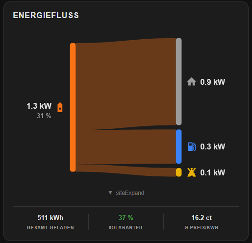</a>
<a href="#flow">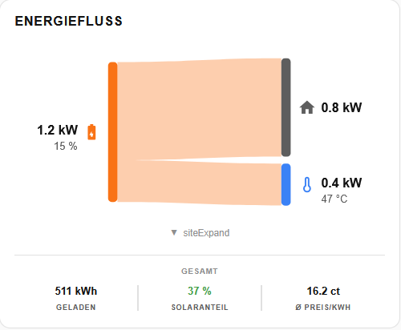</a>
</td>
<td>
<a href="#grid">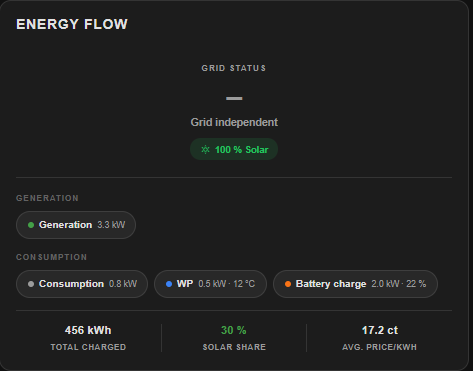</a>
<a href="#grid">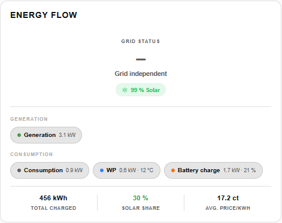</a>
</td>
</tr>
<tr>
<td align="center"><b>Statistics</b></td>
<td align="center"><b>Battery</b></td>
<td align="center"><b>Compact</b></td>
<td align="center"><b>Plan</b></td>
</tr>
<tr>
<td>
<a href="#stats">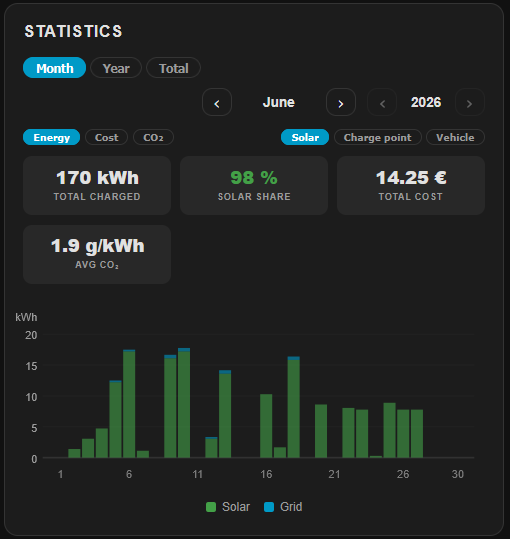</a>
<a href="#stats">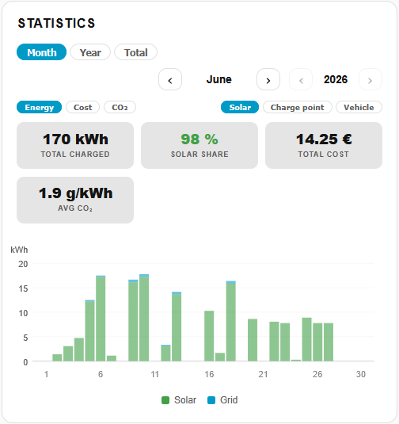</a>
</td>
<td>
<a href="#battery">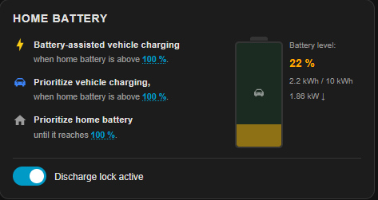</a>
<a href="#battery">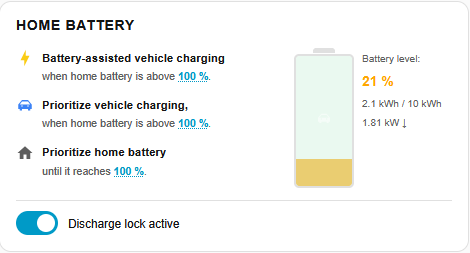</a>
</td>
<td>
<a href="#compact">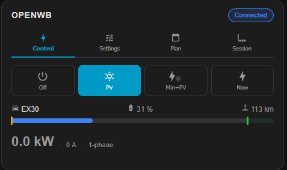</a>
<a href="#compact">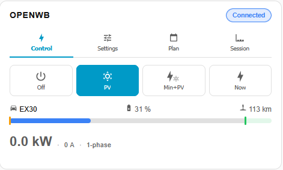</a>
</td>
<td>
<a href="#plan">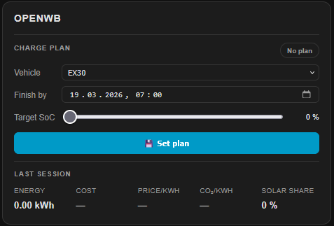</a>
<a href="#plan">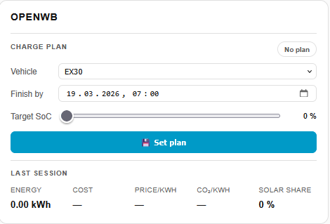</a>
</td>
</tr>
</table>

---

## Features

| Feature | Description |
|---|---|
| **Auto-discovery** | Automatically detects all charge points and site entities via the HA entity registry - zero configuration |
| **Visual editor** | Native card editor in Home Assistant - configure everything interactively, no YAML needed |
| **Live updates** | Power, SoC and status update in real time without full re-render |
| **Responsive scaling** | Card automatically scales to fit larger screens via CSS container queries |
| **SoC display** | Vehicle state of charge as a progress bar with percentage and estimated range |
| **Slider controls** | Adjust Target SoC, Min SoC, Priority, smart charging limit, Max current and Min current inline |
| **Phase switching** | Auto / 1-phase / 3-phase control built in |
| **Multi-language** | Support for various languages - auto-detected from HA language setting, easily extensible |

---

## Prerequisites

- [Home Assistant](https://www.home-assistant.io/) (2023.x or newer)
- [ha-evcc](https://github.com/marq24/ha-evcc) integration installed and configured, with a running [EVCC](https://evcc.io/) instance connected to it

---

## Installation

### Via HACS (recommended)

1. Open **HACS** in Home Assistant
2. Click the three-dot menu (top right) → **Custom repositories**
3. Add this repository URL (https://github.com/mkshb/hass-evcc-card.git) and select category **Dashboard**
4. Search for **EVCC Card** and click **Install**
5. Reload your browser

> **Note for YAML mode users:** If your Lovelace is configured with `mode: yaml` in `configuration.yaml`, HACS cannot register the resource automatically. Add the resource entry manually - see [Manual resource registration](#manual-resource-registration) below.

### Manual installation

1. Download `evcc-card.js` and the `locales/` folder from the [latest release](../../releases/latest)
2. Copy them to `config/www/hass-evcc-card/` in your Home Assistant instance, preserving the folder structure:

```
config/www/hass-evcc-card/
├── evcc-card.js
└── locales/
    ├── index.json
    └── *.json
```

3. Register the resource - see [Manual resource registration](#manual-resource-registration) below.
4. Reload your browser

### Manual resource registration

Depending on how your Lovelace is set up, register the resource in one of two ways:

**UI mode** (default): Go to **Settings → Dashboards → ⋮ → Resources** and add:

```yaml
url: /hacsfiles/hass-evcc-card/evcc-card.js  # if installed via HACS
# or
url: /local/hass-evcc-card/evcc-card.js       # if installed manually
type: module
```

**YAML mode** (`lovelace_mode: yaml` in `configuration.yaml`): Add the resource to your Lovelace YAML configuration file (typically `ui-lovelace.yaml` or referenced via `lovelace: !include`):

```yaml
resources:
  - url: /hacsfiles/hass-evcc-card/evcc-card.js   # if installed via HACS
    type: module
  # or
  - url: /local/hass-evcc-card/evcc-card.js       # if installed manually
    type: module
```

Then restart Home Assistant or reload the Lovelace resources.

---

## Configuration

Add the card to any Lovelace dashboard and use the **visual editor** to configure it - all options are available interactively, and the editor shows only the options relevant to the selected mode.

### Configuration options

| Option | Type | Default | Description |
|---|---|---|---|
| `mode` | `string` | `loadpoint` | Card mode: `loadpoint`, `compact`, `battery`, `site`, `flow`, `grid`, `stats`, `plan` |
| `title` | `string` | *(auto)* | Replaces the default card header |
| `loadpoints` | `list` | *(all)* | Filter charge points by name |
| `language` | `string` | *(auto)* | Override UI language |
| `no_plan` | `list` | *(none)* | Hide charge plan block for specific charge points |
| `site_details` | `string` | `expanded` | `collapsed` to hide the IN/OUT detail table by default in `site` and `flow` mode |
| `charge_current_settings` | `string` | `collapsed` | `expanded` to show charge settings expanded by default |
| `stats_period` | `string` | `total` | Default statistics period: `total`, `30d`, `365d`, `thisYear`, `none` |
| `prefix` | `string` | *(auto)* | **YAML only** — Entity prefix, auto-detected from ha-evcc. Only needed for multiple EVCC instances with custom prefixes. |

> **YAML Configurator:** For users who prefer YAML configuration, the interactive **[YAML Configurator](https://mkshb.github.io/hass-evcc-card/configurator.html)** is still available to generate card configurations for special cases.

---

## Modes

### `loadpoint` (default)

The main charge point view. For each discovered charge point it shows:

- Charge mode buttons (Off / PV / Min+PV / Now)
- Vehicle SoC progress bar with percentage and estimated range
- Current charging session: energy, cost, duration, phases
- Sliders: Target SoC, Min SoC, Priority SoC
- Charge plan block

The **CHARGE SETTINGS** section is collapsed by default and can be toggled using the gear icon. It contains:
- Phase switch: Auto / 1-phase / 3-phase
- Max current / Min current sliders
- Smart charging limit - threshold below which charging starts automatically; shows "Off" when set to 0; EVCC supports either CO2-based (g/kWh) **or** price-based (EUR/kWh) - not both simultaneously; the active mode is reflected in the entity's unit

> **Price mode - slider range issue:** When switching the smart charging mode in EVCC from CO2-based to price-based, ha-evcc may not recreate the limit entity. The slider then still shows the CO2 range (0-500 g/kWh) instead of the price range. To fix this, go to Settings -> Devices & Services -> ha-evcc -> **Reconfigure**, and enable the option **"Remove and recreate all Devices"**.

 

---

### `site`

Full site energy overview:

- PV production bar split into: home consumption / charging / battery / feed-in
- Individual PV string values (e.g. BKW, Dach) shown as indented sub-rows
- Live power table with IN/OUT sections: Grid import/export, PV generation, home consumption, charging, battery
- Battery SoC shown inline in the charging/discharging row
- Active charge points shown as indented sub-rows under the charging row

The IN/OUT detail table can be toggled by clicking the power bar. It opens expanded by default; set `site_details` to `collapsed` in the editor to start collapsed instead.

 

---

### `flow`

Sankey-style energy flow diagram showing how energy is distributed from sources to consumers in real time:

- **Sources** (left): PV strings, battery (discharging), grid import — each as a colored node
- **Consumers** (right): home consumption, individual charge points, battery (charging), grid export
- Flowing bands connect sources to consumers, with width proportional to power — PV is distributed first, then battery, then grid
- Each node shows an MDI icon and current power value; battery and vehicle nodes include SoC as a sub-label
- All nodes are clickable to open the Home Assistant entity detail dialog
- Collapsible IN/OUT detail table below — click the diagram to toggle (same as `site` mode)

 

---

### `grid`

Compact site energy overview with a focus on the current grid status:

- Large net grid value with color coding: red for import, green for export
- Solar self-sufficiency badge (e.g. `86 % Solar`) shown when PV is active
- Source chips: active energy sources (PV generation, grid import, battery discharge)
- Consumer chips: active consumers (home consumption, charge points with vehicle SoC/temperature, battery charging, grid export)

> **Deprecation notice:** `mode: site2` still works but is deprecated and will be removed in a future release. Please migrate to `mode: grid`.

 

---

### `stats`

Charging statistics with period selector and a matching bar chart:

- **Period tabs:** 30 days / 365 days / This year / Total - switch with a single tap; the selection is remembered for the session
- Three KPIs per period: charged energy (kWh), solar share (%), average price (ct/kWh)
- The bar chart adapts to the selected period:

| Tab | Chart | Bars |
|---|---|---|
| **30 days** | Daily values | 30 bars (day.month labels) |
| **365 days** | Rolling monthly | 13 bars (3-letter month labels) |
| **This year** | Monthly, current calendar year | Jan - current month |
| **Total** | One bar per year | All available years |

- Chart data is fetched lazily per tab on first access and cached for 5 minutes
- The same three KPIs also appear as a compact footer row at the bottom of `site` and `grid` cards - the period shown there is controlled via `stats_period` (default: `total`). Set `stats_period` to `none` to hide the footer entirely.

**Solar breakdown in the bar chart:** When `sensor.evcc_stat_total_solar_k_wh_template` is available, each bar is split into a **green** (solar) and **blue** (grid) portion. This sensor was recently added to [ha-evcc](https://github.com/marq24/ha-evcc) - thanks to [@marq24](https://github.com/marq24) for adding it! The sensor needs at least 3 days of HA Recorder history before the split appears. No configuration is needed - once enough history has been collected, the solar breakdown appears automatically.

<a name="enabling-stat-periods"></a>

> **Periods not showing data?** The **Total** period is enabled by default in ha-evcc. The sensor entities for **30 days**, **365 days** and **This year** are **disabled by default** in Home Assistant and must be enabled manually. If a period tab shows a warning instead of statistics, follow the steps below.

#### Enabling the stat entities in Home Assistant

The stat sensors exist in your ha-evcc integration but are disabled by default. To enable them:

1. In Home Assistant, open **Settings** -> **Devices & Services**
2. Click on the **ha-evcc** integration
3. Open your evcc device (e.g. *"evcc Solar Charging [evcc]"*)
4. Scroll down to the section that says **"X disabled entities"** and click on it
5. Enable the statistics entities for the periods you want: **30 days** (`stat30_*`), **365 days** (`stat365_*`) and/or **This year** (`stat_this_year_*`)
6. Each period has three entities: `_charged_kwh`, `_solar_percentage` and `_avg_price` - enable all three for full statistics. Since ha-evcc **2026.2** there is also `_solar_k_wh_template` which is needed for the solar/grid split in the bar chart
7. Wait a moment or reload the ha-evcc integration - the stat periods should then appear in the card

> **Note:** After enabling, it may take a few minutes until the first values appear, as Home Assistant needs to record the initial data points for these entities.

> **Single-year fallback:** If the **Total** tab detects that only one calendar year of data is available in the HA Recorder, it automatically falls back to showing the monthly breakdown of the current year - identical to the **This year** chart.

 

---

### `battery`

Home battery management block:

- Current battery SoC with visual indicator
- Buffer SoC slider
- Priority SoC slider
- Discharge lock toggle

 

---

### `compact`

Same content as `loadpoint`, but organized into four tabs - ideal for dashboards where vertical space is limited or multiple charge points are shown side by side:

| Tab | Contents |
|---|---|
| **Control** | Charge mode buttons, vehicle SoC bar, current charging power |
| **Settings** | Target SoC, Min SoC, Priority sliders, phase switch, current limits, smart charging limit |
| **Plan** | Charge plan: vehicle selector, target time, target SoC, activate/delete |
| **Session** | Energy, cost, duration and phases of the current session |

The selected tab is remembered per charge point across re-renders.

 

---

### `plan`

Minimalist charge plan view:

- Vehicle selector
- Target time picker
- Target SoC slider
- Activate / delete plan

 

---

## Entity detection

The card automatically detects all ha-evcc entities via the **Home Assistant entity registry** (`platform: evcc_intg`). The entity prefix is derived automatically - no configuration needed.

Entities follow the [ha-evcc](https://github.com/marq24/ha-evcc) naming convention:

```
sensor.evcc_<loadpoint_name>_<entity_type>
select.evcc_<loadpoint_name>_mode
number.evcc_<loadpoint_name>_limit_soc
...
```

> **Edge case:** If you run **multiple EVCC instances** with a custom prefix (e.g. `evcc2_`), you can override the auto-detection via YAML:
>
> ```yaml
> type: custom:evcc-card
> prefix: evcc2_
> ```

---

## Translations

<!-- LANGUAGES_START -->

<!-- LANGUAGES_END -->

The card ships with multiple languages and automatically uses the language configured in Home Assistant. You can override it per card in the visual editor or via the `language` config option.

Translations are stored as simple JSON files in the `dist/locales/` folder. Adding a new language takes only two steps:

1. Create a new file `dist/locales/<lang>.json` by copying an existing one (e.g. `en.json`) and translating the values
2. Add the language code to `dist/locales/index.json`

**Want to contribute a translation?** Pull requests for new languages are very welcome! Have a look at [`dist/locales/en.json`](dist/locales/en.json) as a starting point and open a PR with your new language file.

---

## FAQ

### Why does the solar share show 0 % or nothing for older charging sessions?

The solar share visualization in the stats chart requires `sensor.evcc_stat_total_solar_k_wh_template`, which was introduced in [ha-evcc](https://github.com/marq24/ha-evcc) version **2026.3.3**. Historical sessions recorded before that version are missing the underlying data, so a correct solar share cannot be calculated retroactively. Only sessions recorded after upgrading to ha-evcc 2026.3.3 or later will show solar share data.

---

## Contributing

Pull requests are welcome! Please open an issue first to discuss what you'd like to change.

1. Fork the repository
2. Create a feature branch: `git checkout -b feature/my-feature`
3. Commit your changes: `git commit -m 'Add my feature'`
4. Push to the branch: `git push origin feature/my-feature`
5. Open a Pull Request

Contributions that are especially appreciated:

- **New translations** - see the [Translations](#translations) section above
- **Bug reports and fixes**
- **Feature suggestions and implementations**

---

## Videos & Blog Posts

The card was featured in YouTube videos - showing installation, configuration and usage in practice. Note: the videos are in **German**.

<table>
<tr>
<td align="center">
<a href="https://www.youtube.com/watch?v=o-EA3kuslmQ">
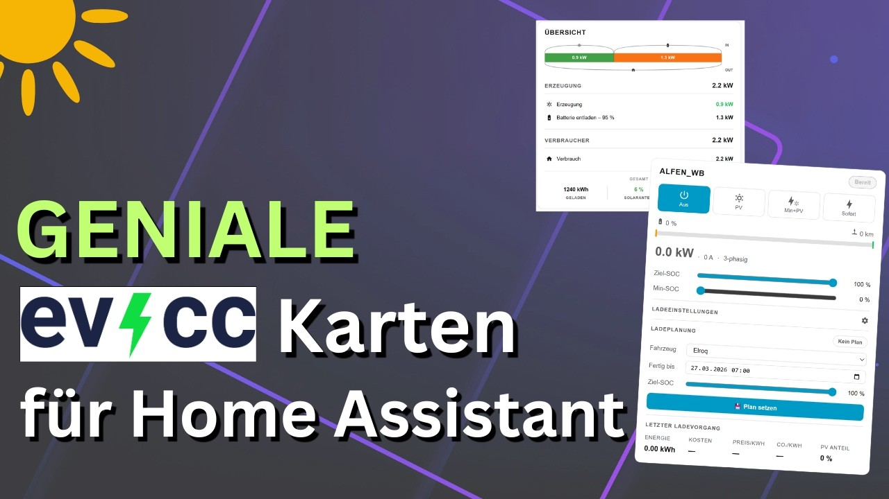
</a>
</td>
<td align="center">
<a href="https://www.youtube.com/watch?v=nQyiFg1RPy8">
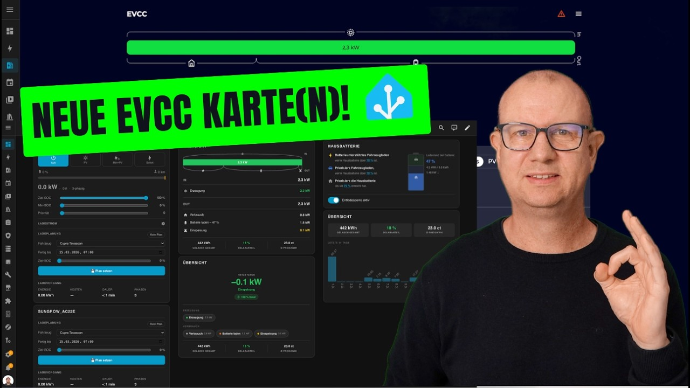
</a>
</td>
</tr>
</table>

[](https://smarterkram.de/9659/evcc-card-fuer-home-assistant/)

A detailed blog post about the card is available on [smarterkram.de](https://smarterkram.de/9659/evcc-card-fuer-home-assistant/) (German).

---

## License

[MIT](LICENSE)

---

## Related projects

- [EVCC](https://evcc.io/) - the EV charging controller this card is built for
- [ha-evcc](https://github.com/marq24/ha-evcc) - the Home Assistant integration providing all entities
