# EVCC Card for Home Assistant

[](https://github.com/hacs/integration) [](LICENSE) [](https://github.com/mkshb/hass-evcc-card/actions/workflows/validate.yaml) <!-- LANGUAGES_START --><!-- LANGUAGES_END --> [](https://github.com/mkshb/hass-evcc-card/stargazers) [](https://github.com/mkshb/hass-evcc-card/commits/main) [](https://github.com/mkshb/hass-evcc-card/issues)

A custom Lovelace card for [Home Assistant](https://www.home-assistant.io/) that provides a comprehensive dashboard for [EVCC](https://evcc.io/) - the open-source EV charging controller - using the [ha-evcc integration](https://github.com/marq24/ha-evcc).

All charge points and site entities are **automatically discovered** via the HA entity registry - no manual entity mapping required. Starting with v0.5.0, the card includes a **native visual editor** - just add the card and configure everything interactively.

---

## Screenshots

<table>
<tr>
<td align="center"><b>Charge Point</b></td>
<td align="center"><b>Site</b></td>
<td align="center"><b>Flow</b></td>
<td align="center"><b>Grid</b></td>
</tr>
<tr>
<td>
<a href="#loadpoint-default">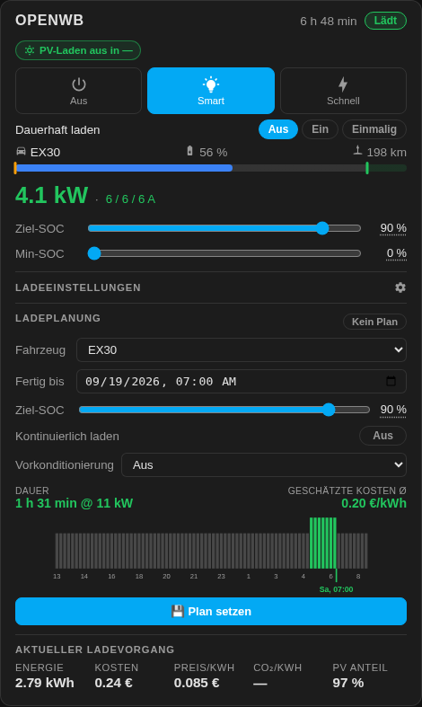</a>
<a href="#loadpoint-default">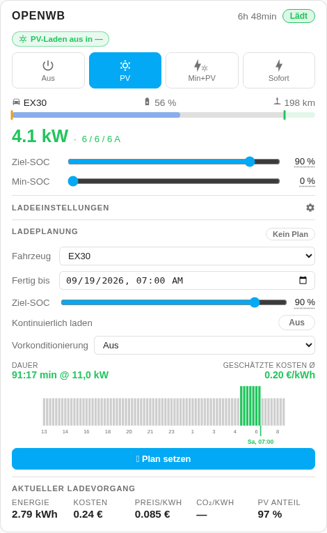</a>
</td>
<td>
<a href="#site">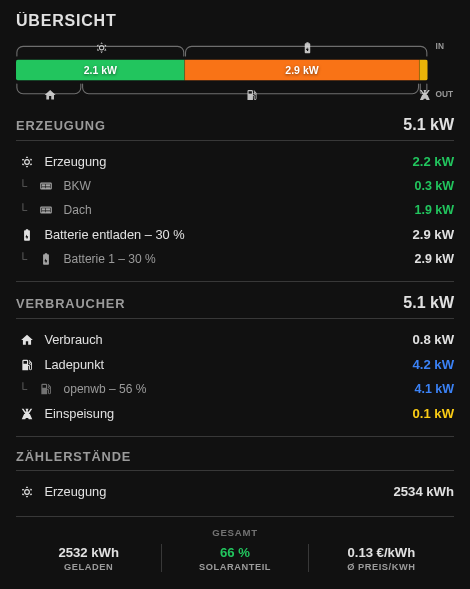</a>
<a href="#site">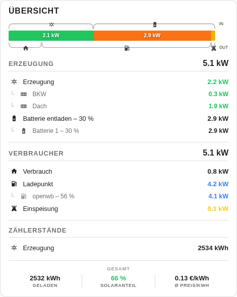</a>
</td>
<td>
<a href="#flow">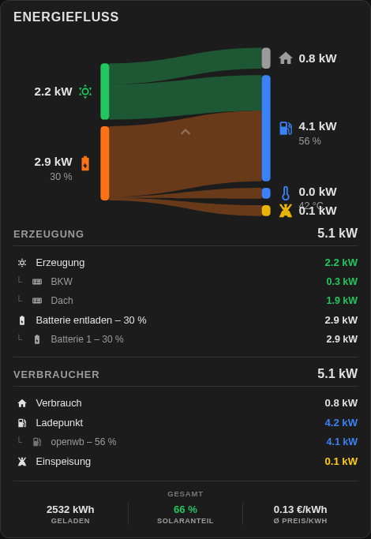</a>
<a href="#flow">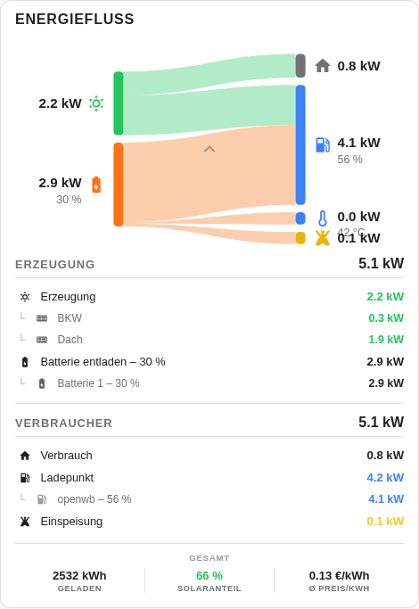</a>
</td>
<td>
<a href="#grid">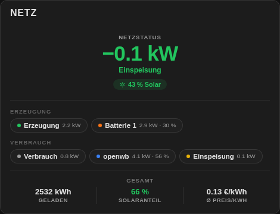</a>
<a href="#grid">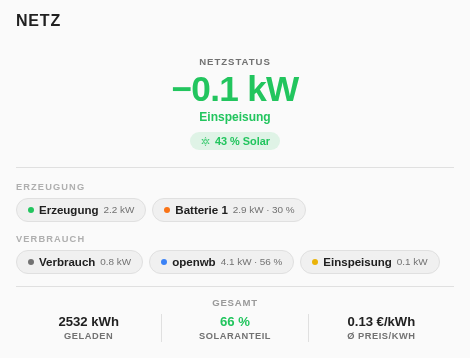</a>
</td>
</tr>
<tr>
<td align="center"><b>Statistics</b></td>
<td align="center"><b>Battery</b></td>
<td align="center"><b>Compact</b></td>
<td align="center"><b>Plan</b></td>
</tr>
<tr>
<td>
<a href="#stats">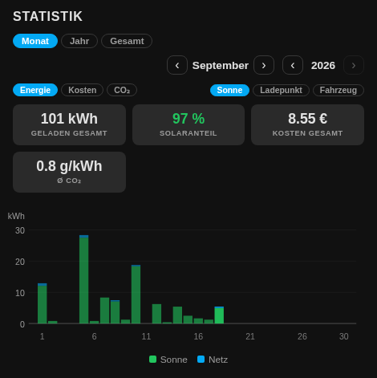</a>
<a href="#stats">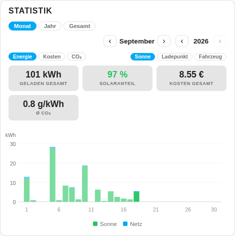</a>
</td>
<td>
<a href="#battery">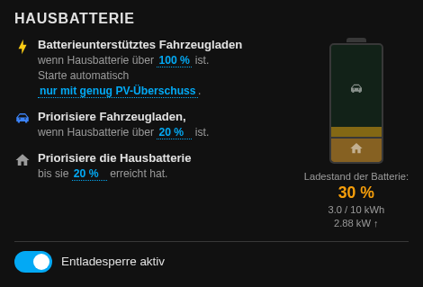</a>
<a href="#battery">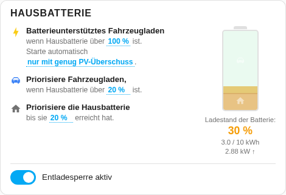</a>
</td>
<td>
<a href="#compact">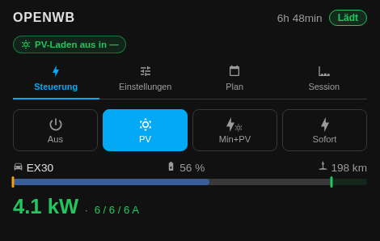</a>
<a href="#compact">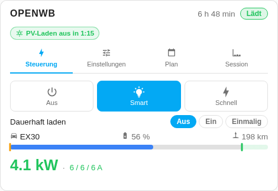</a>
</td>
<td>
<a href="#plan">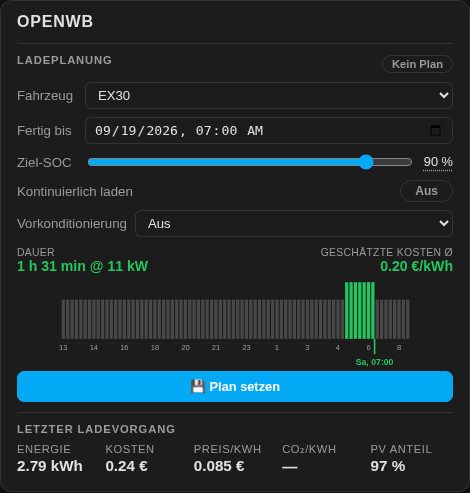</a>
<a href="#plan">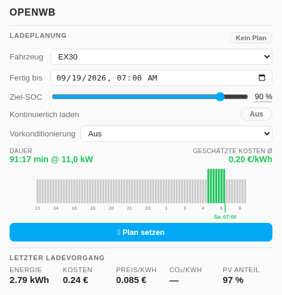</a>
</td>
</tr>
<tr>
<td align="center"><b>Priority</b></td>
<td align="center"><b>Repeat plan</b></td>
<td></td><td></td>
</tr>
<tr>
<td>
<a href="#priority">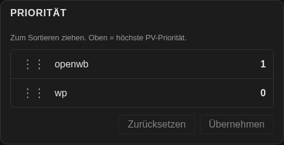</a>
<a href="#priority">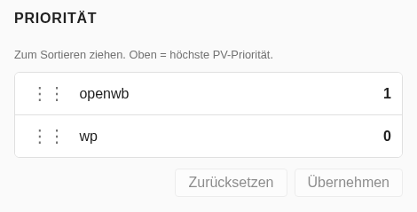</a>
</td>
<td>
<a href="#repeatplan">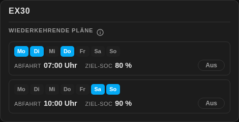</a>
<a href="#repeatplan">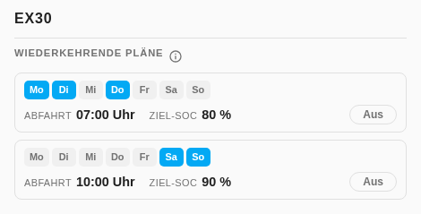</a>
</td>
<td></td><td></td>
</tr>
</table>

---

## Features

| Feature | Description |
|---|---|
| **Auto-discovery** | Automatically detects all charge points and site entities via the HA entity registry - zero configuration |
| **Visual editor** | Native card editor in Home Assistant - configure everything interactively, no YAML needed |
| **Live updates** | Power, SoC and status update in real time without full re-render |
| **Responsive scaling** | Card automatically scales to fit larger screens via CSS container queries; can be overridden with a fixed `size` |
| **SoC display** | Vehicle state of charge as a progress bar with percentage and estimated range |
| **Slider controls** | Adjust Target SoC, Min SoC, Priority, smart charging limit, feed-in priority limit, battery boost, Max current and Min current inline |
| **Phase switching** | Auto / 1-phase / 3-phase control built in |
| **Plan strategies** | Continuous charging and battery preconditioning settings inline in the plan block |
| **Repeating plans** | `repeatplan` mode lists evcc's weekly repeating charge plans per vehicle and toggles them on/off (ha-evcc 2026.6.1+) |
| **Live plan preview** | In `plan` mode, a live chart previews the planned charging window over the upcoming tariff/forecast, with duration, power and average price/CO₂ (ha-evcc 2026.6.x+) |
| **Session statistics** | `stats` mode is powered directly by evcc's charging-session history: no helper sensors or recorder setup, with metric (energy / cost / CO₂) and grouping (solar / charge point / vehicle) toggles (ha-evcc 2026.6.x+) |
| **Heating loadpoints** | Heat-pump / heating loadpoints are detected automatically: no EV charge plan, and the target/limit is shown as a temperature |
| **Action indicators** | Pending phase switches (1↔3 phase) and PV-charging start/stop shown as inline countdown chips |
| **Diagnostics** | Built-in `debug` mode collects card / HA / integration state into a copy-paste-ready bug report |
| **Multi-language** | Support for various languages - auto-detected from HA language setting, easily extensible |

---

## Prerequisites

- [Home Assistant](https://www.home-assistant.io/) (2023.x or newer)
- [ha-evcc](https://github.com/marq24/ha-evcc) integration installed and configured, with a running [EVCC](https://evcc.io/) instance connected to it
- For the **live plan preview** and the **session-based statistics**, ha-evcc **2026.6.x or newer** is required (it ships evcc's WebSocket data API). On older versions these features fall back automatically and the rest of the card keeps working.

---

## Installation

### Via HACS (recommended)

`hass-evcc-card` is part of the **default HACS repository** - no custom repository setup needed.

1. Open **HACS** in Home Assistant
2. Search for **EVCC Card**
3. Click **Download**
4. Reload your browser

[](https://my.home-assistant.io/redirect/hacs_repository/?owner=mkshb&repository=hass-evcc-card&category=plugin)

> **Note for YAML mode users:** If your Lovelace is configured with `mode: yaml` in `configuration.yaml`, HACS cannot register the resource automatically. Add the resource entry manually - see [Manual resource registration](#manual-resource-registration) below.

### Manual installation

1. Download `evcc-card.js` and the `locales/` folder from the [latest release](../../releases/latest)
2. Copy them to `config/www/hass-evcc-card/` in your Home Assistant instance, preserving the folder structure:

```
config/www/hass-evcc-card/
├── evcc-card.js
└── locales/
    ├── index.json
    └── *.json
```

3. Register the resource - see [Manual resource registration](#manual-resource-registration) below.
4. Reload your browser

### Manual resource registration

Depending on how your Lovelace is set up, register the resource in one of two ways:

**UI mode** (default): Go to **Settings → Dashboards → ⋮ → Resources** and add:

```yaml
url: /hacsfiles/hass-evcc-card/evcc-card.js  # if installed via HACS
# or
url: /local/hass-evcc-card/evcc-card.js       # if installed manually
type: module
```

**YAML mode** (`lovelace_mode: yaml` in `configuration.yaml`): Add the resource to your Lovelace YAML configuration file (typically `ui-lovelace.yaml` or referenced via `lovelace: !include`):

```yaml
resources:
  - url: /hacsfiles/hass-evcc-card/evcc-card.js   # if installed via HACS
    type: module
  # or
  - url: /local/hass-evcc-card/evcc-card.js       # if installed manually
    type: module
```

Then restart Home Assistant or reload the Lovelace resources.

---

## Configuration

Add the card to any Lovelace dashboard and use the **visual editor** to configure it - all options are available interactively, and the editor shows only the options relevant to the selected mode.

Adding an evcc entity to a dashboard offers the card straight away: the picker suggests the **Loadpoint** and **Compact** views for a charge point entity and the **Site** and **Flow** views for a site, meter or vehicle entity, with the charge point already filled in.

### Configuration options

| Option | Type | Default | Description |
|---|---|---|---|
| `mode` | `string` | `loadpoint` | Card mode: `loadpoint`, `compact`, `battery`, `site`, `flow`, `grid`, `stats`, `plan`, `repeatplan`, `priority`, `debug` |
| `title` | `string` | *(auto)* | Replaces the default card header |
| `loadpoints` | `list` | *(all)* | Filter charge points by name |
| `language` | `string` | *(auto)* | Override UI language |
| `size` | `string` | *(auto)* | Fixed card scale: `small`, `medium` or `large`. When unset, the card auto-scales to its container width |
| `no_plan` | `list` | *(none)* | Hide charge plan block for specific charge points |
| `repeating_plan_vehicles` | `list` | *(all)* | Limit the `repeatplan` mode to specific vehicles |
| `plan_loadpoint_index` | `map` | *(auto)* | **YAML only** — Override the evcc loadpoint index (1-based) used for the plan preview, e.g. `{ openwb: 1, wp: 2 }`. Only needed if the auto-detected order does not match evcc |
| `no_pv` | `list` | *(none)* | Treat specific charge points as having **no PV system**, mirroring evcc's own mode logic: the **Smart** mode is offered only when a dynamic tariff is configured (otherwise only **Off** / **Fast** remain). See [Charge modes](#charge-modes) below |
| `disabled_loadpoints` | `string` | `hide` | How to treat charge points disabled in the evcc configuration (ha-evcc 2026.8.8+): `hide` removes them from the card, `dim` shows them grayed out with a "Disabled" badge, `show` keeps the previous behavior |
| `site_details` | `string` | `expanded` | `collapsed` to hide the IN/OUT detail table by default in `site` and `flow` mode |
| `charge_current_settings` | `string` | `collapsed` | `expanded` to show charge settings expanded by default |
| `hide_settings` | `list` | *(none)* | Remove individual settings from the `loadpoint` / `compact` card: `limit_soc`, `min_soc`, `phases`, `max_current`, `min_current`, `battery_boost`, `priority`, `smart_cost_limit`, `smart_feed_in_priority_limit`. See [Slider settings](#slider-settings) |
| `slider_steps` | `map` | *(entity)* | **YAML only** — Override the step of a number slider per setting, e.g. `{ smart_cost_limit: 0.01, limit_soc: 5 }`. Keys are ha-evcc feature names and are matched exactly. Also sets the increment of the − / + buttons in the direct-input panel. Number entities only. See [Slider settings](#slider-settings) |
| `stats_period` | `string` | *(see note)* | Statistics period: `month`, `year`, `total`, `none`. Unconfigured, the `stats` mode opens on the most recent month and the footer under `site`/`grid`/`flow` summarises everything; `none` hides that footer. The older values `30d`, `365d` and `thisYear` still work |
| `prefix` | `string` | *(auto)* | Entity prefix, auto-detected from ha-evcc. With more than one ha-evcc entry the visual editor offers the instance to use; the first entry is the default and needs no `prefix` |

> **Invalid values are rejected.** `mode`, `size`, `disabled_loadpoints` and `stats_period` only accept the values listed above, and `prefix`, `language` and `loadpoints` have to be non-empty. A dashboard carrying something else shows the Home Assistant error card naming the option, instead of quietly falling back to another view.

---

## Modes

### `loadpoint` (default)

The main charge point view. For each discovered charge point it shows:

- Charge mode buttons (Off / Smart / Fast, plus the **Always charge** row of the Smart mode) - see [Charge modes](#charge-modes) for when which mode is shown
- Vehicle SoC progress bar with percentage and estimated range
- Current charging session: energy, cost, duration, phases
- Sliders: Target SoC, Min SoC - tap the value next to any slider to enter it directly, see [Slider settings](#slider-settings)
- Charge plan block

A tap on a value in the header opens the more-info dialog of the ha-evcc entity behind it, as the rows of the `site` and `flow` views do: the status badge and the remaining time, the vehicle name, SoC and range, the charging power, current and phases, and the figures of the charging session. The sliders keep their own action.

#### Charge modes

The card renders the modes the ha-evcc mode entity offers, so it follows whatever evcc version is behind it:

| evcc version | Modes shown |
| --- | --- |
| 0.316 and newer | **Off** / **Smart** / **Fast**, plus an **Always charge** row (Off / On / Once) under the buttons while the Smart mode is active |
| before 0.316 | **Off** / **PV** / **Min+PV** / **Fast** |

evcc 0.316 replaced the **PV** mode with **Smart** and turned **Min+PV** into the **Always charge** setting of the Smart mode: charge without interruption at least at the minimum current, either permanently (**On**) or for the running session only (**Once**). ha-evcc 2026.8.3 or newer detects this on startup, so after updating evcc, reload the ha-evcc integration once (or restart Home Assistant) for the new modes to appear. Switch devices (a heat pump with SG-Ready, a heating rod) get no Always charge row, as in evcc itself.

**Heating loadpoints** carry evcc's own labels: **Normal** / **Smart** / **Boost** instead of Off / Smart / Fast.

The **`no_pv`** option mirrors evcc's mode logic for a charge point without a PV system, where the Smart mode depends on a dynamic electricity tariff:

| Situation | Modes shown |
| --- | --- |
| `no_pv` set + dynamic tariff available | **Off** / **Smart** / **Fast** |
| `no_pv` set + no dynamic tariff | **Off** / **Fast** |

> A dynamic tariff is detected via the `tariff_grid` (price) or `tariff_co2` (CO2) sensor; if neither reports a value, only **Off** / **Fast** are offered. On an evcc before 0.316 the card does what evcc did then: **PV** is relabelled as **Smart** and still sets the underlying `pv` mode, **Min+PV** is dropped.

The loadpoint header also shows **live action indicators** when EVCC has scheduled a pending phase switch or PV-charging change - e.g. *"Switching to 3-phase in 0:42"* or *"PV charging on in 1:15"*. The chip disappears automatically once the action is executed. Requires ha-evcc with the `phase_action` / `pv_action` sensors exposed.

The **CHARGE SETTINGS** section is collapsed by default and can be toggled using the gear icon. It contains:
- Phase switch: Auto / 1-phase / 3-phase
- Max current / Min current sliders
- Battery boost - lets the vehicle draw from the home battery; the slider sets the battery SoC threshold above which boosting is allowed. Only shown when ha-evcc exposes the battery boost entities (`battery_boost_limit`, `battery_boost`)
- Priority - PV-surplus priority of this charge point relative to the others
- Smart charging limit - threshold below which charging starts automatically; shows "Off" when set to 0; EVCC supports either CO2-based (g/kWh) **or** price-based (EUR/kWh) - not both simultaneously; the active mode is reflected in the entity's unit
- Feed-in priority limit - threshold above which EVCC prioritizes feeding into the grid over charging from PV surplus, shown directly under the smart charging limit. Like the smart charging limit, it follows EVCC's global cost mode, so the slider is in currency/kWh (price mode) or g/kWh (CO2 mode). It has a slider, an "active" hint (from the `smart_feed_in_priority_active` sensor) and a clear button. The `smart_feed_in_priority_limit` / `smart_feed_in_priority_active` entities ship **disabled by default** in ha-evcc, so the row stays hidden until you enable them

> **Price mode - slider range issue:** When switching the smart charging mode in EVCC from CO2-based to price-based, ha-evcc may not recreate the limit entity. The slider then still shows the CO2 range (0-500 g/kWh) instead of the price range. To fix this, go to Settings -> Devices & Services -> ha-evcc -> **Reconfigure**, and enable the option **"Remove and recreate all Devices"**.

#### Slider settings

Every slider in the card (target SoC, min SoC, current limits, battery boost, priority, smart charging limit, feed-in priority limit, and the target SoC of the charge plan) can also be set without dragging:

- **Direct input** - tap the value next to the slider. A touch-sized row opens below it with **−** and **+** buttons, a number field with the unit, and apply / cancel. The buttons walk the slider step (for the current sliders: the next available option), the field accepts an exact value with either a comma or a dot and is clamped to the slider range. **Enter** or **✓** writes the value, **Escape** or **✕** discards it. Only one panel is open at a time.
- **Keyboard** - with the slider focused, the arrow keys, Home / End and PageUp / PageDown change the value and write it as well. Everything else that reacts to a tap (the more-info rows, the flow graphic that folds the detail table, the buttons and chips) is reachable with Tab and fires on Enter or Space.
- **Step size** - the step comes from the ha-evcc entity (for example 0.005 for the smart charging limit). Use `slider_steps` to make a slider coarser or finer per setting; the − / + buttons follow the same step:

  ```yaml
  type: custom:evcc-card
  slider_steps:
    smart_cost_limit: 0.01
    limit_soc: 5
  ```

  The key is the ha-evcc feature name and has to match it exactly: `limit_soc` steers the target SoC and nothing else, `soc` steers nothing at all. `slider_steps` applies to settings ha-evcc provides as a `number` entity. The current limits and, depending on the ha-evcc version, min SoC and target SoC come as a `select`; their sliders walk the option list, so a step configured for them has no effect and the card says so in the browser console.

- **Hide settings** - settings you never touch can be removed from the card with `hide_settings` (also available as checkboxes in the visual editor). The list applies to every charge point on the card; use separate cards with a `loadpoints` filter if charge points need different sets. When everything in the charge settings section is hidden, the section and its gear button disappear:

  ```yaml
  type: custom:evcc-card
  hide_settings:
    - smart_feed_in_priority_limit
    - priority
    - phases
  ```

> **Resetting a limit:** the smart charging limit and the feed-in priority limit have a **clear** button that removes the limit in evcc. The other sliders have no default value in evcc, so there is nothing to reset them to.

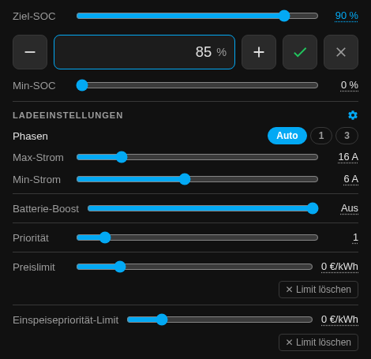 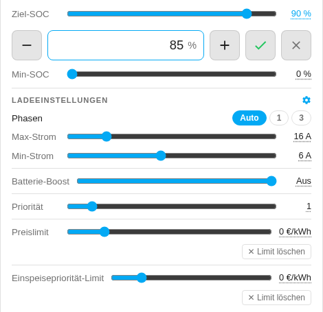

 

---

### `site`

Full site energy overview:

- PV production bar split into: home consumption / charging / battery / feed-in
- Individual PV string values (e.g. BKW, Dach) shown as indented sub-rows
- Live power table with IN/OUT sections: Grid import/export, PV generation, home consumption, charging, battery
- Battery SoC shown inline in the charging/discharging row
- Active charge points shown as indented sub-rows under the charging row

The IN/OUT detail table can be toggled by clicking the power bar. It opens expanded by default; set `site_details` to `collapsed` in the editor to start collapsed instead.

 

---

### `flow`

Sankey-style energy flow diagram showing how energy is distributed from sources to consumers in real time:

- **Sources** (left): PV strings, battery (discharging), grid import — each as a colored node
- **Consumers** (right): home consumption, individual charge points, battery (charging), grid export
- Flowing bands connect sources to consumers, with width proportional to power — PV is distributed first, then battery, then grid
- Each node shows an MDI icon and current power value; battery and vehicle nodes include SoC as a sub-label
- All nodes are clickable to open the Home Assistant entity detail dialog
- Collapsible IN/OUT detail table below — click the diagram to toggle (same as `site` mode)

 

---

### `grid`

Compact site energy overview with a focus on the current grid status:

- Large net grid value with color coding: red for import, green for export
- Solar self-sufficiency badge (e.g. `86 % Solar`) shown when PV is active
- Source chips: active energy sources (PV generation, grid import, battery discharge)
- Consumer chips: active consumers (home consumption, charge points with vehicle SoC/temperature, battery charging, grid export)

> **Deprecation notice:** `mode: site2` still works but is deprecated and will be removed in a future release. Please migrate to `mode: grid`.

 

---

### `stats`

Charging statistics, powered directly by evcc's **charging-session history** (ha-evcc 2026.6.x+). No helper sensors and no HA Recorder setup are required: the card reads the full session list once via the integration's WebSocket data API and computes everything in the browser. The header mirrors evcc's own statistics view:

- **Period:** **Month**, **Year** or **Total**, each with back/forward steppers to pick the exact month and year
- **Metric:** switch the bars between **Energy** (kWh), **Cost** and **CO₂**
- **Grouping:** stack the bars by **Solar** vs grid, by **charge point** or by **vehicle**, with a colour legend
- **Tooltips:** hover or tap a bar to see every series and the total for that day, month or year
- KPI tiles above the chart summarise the selected period (charged energy, solar share, cost, CO₂)

| Period | Bars |
|---|---|
| **Month** | One bar per day of the selected month |
| **Year** | One bar per month of the selected year |
| **Total** | One bar per year (falls back to monthly when only one year of data exists) |

- The data comes from a single request that is cached for 5 minutes on the card and additionally cached inside the integration, so switching periods, metrics and groupings is instant and puts practically no load on evcc.
- A compact summary also appears as a footer row at the bottom of `site` and `grid` cards. The period shown there is controlled via `stats_period` (default: `total`); set `stats_period` to `none` to hide the footer entirely.

> **Heating loadpoints** (heat pumps) are included like any other loadpoint; with the **charge point** or **vehicle** grouping they show up as their own series.

> **Note on the Solar grouping:** for the **Cost** and **CO₂** metrics the solar share carries no marginal cost/emissions, so those are attributed to the grid series (only **Energy** is split proportionally into solar and grid).

<a name="enabling-stat-periods"></a>

#### Older ha-evcc versions (fallback)

On ha-evcc versions **before 2026.6.x** the WebSocket session API is not available. The card then falls back to the previous statistics implementation, which is built on dedicated `stat_*` sensor entities and the HA Recorder. In that mode the period tabs are **30 days / 365 days / This year / Total**, each bar is split into a **green** (solar) and **blue** (grid) portion via `sensor.evcc_stat_total_solar_k_wh_template`, and the data is fetched lazily per tab and cached for 5 minutes.

> **Periods not showing data?** The **Total** period is enabled by default in ha-evcc. The sensor entities for **30 days**, **365 days** and **This year** are **disabled by default** in Home Assistant and must be enabled manually. If a period tab shows a warning instead of statistics, follow the steps below.

The stat sensors exist in your ha-evcc integration but are disabled by default. To enable them:

1. In Home Assistant, open **Settings** -> **Devices & Services**
2. Click on the **ha-evcc** integration
3. Open your evcc device (e.g. *"evcc Solar Charging [evcc]"*)
4. Scroll down to the section that says **"X disabled entities"** and click on it
5. Enable the statistics entities for the periods you want: **30 days** (`stat30_*`), **365 days** (`stat365_*`) and/or **This year** (`stat_this_year_*`)
6. Each period has three entities: `_charged_kwh`, `_solar_percentage` and `_avg_price` - enable all three for full statistics. Since ha-evcc **2026.2** there is also `_solar_k_wh_template` which is needed for the solar/grid split in the bar chart
7. Wait a moment or reload the ha-evcc integration - the stat periods should then appear in the card

> **Note:** After enabling, it may take a few minutes until the first values appear, as Home Assistant needs to record the initial data points for these entities.

> **Single-year fallback:** If the **Total** tab detects that only one calendar year of data is available in the HA Recorder, it automatically falls back to showing the monthly breakdown of the current year - identical to the **This year** chart.

 

---

### `battery`

Home battery management block:

- Current battery SoC with visual indicator
- Buffer SoC slider
- Priority SoC slider
- Discharge lock toggle

 

---

### `priority`

PV surplus priority management: reorder all loadpoints by drag-and-drop to set which one is preferred when distributing PV excess. Higher position = higher priority.

- One row per discovered loadpoint, sorted by current priority (highest at top)
- Drag the ⋮⋮ handle to reorder; the rendered target value updates live
- Rows with a target that differs from the current entity state are highlighted in amber and show the old value as `(N)` next to the target
- **Apply** writes the new priorities via `number.set_value` for every loadpoint whose value would change. Values are assigned contiguously: top = `N-1`, bottom = `0`
- **Reset** discards unapplied changes and re-syncs the visible order to the current state
- Respects the `loadpoints` config filter; loadpoints without a `priority` entity are shown disabled

 

---

### `compact`

Same content as `loadpoint`, but organized into four tabs - ideal for dashboards where vertical space is limited or multiple charge points are shown side by side:

| Tab | Contents |
|---|---|
| **Control** | Charge mode buttons, vehicle SoC bar, current charging power |
| **Settings** | Target SoC, Min SoC sliders, phase switch, current limits, battery boost, priority, smart charging limit, feed-in priority limit (each can be hidden via `hide_settings`, values can be typed directly, see [Slider settings](#slider-settings)) |
| **Plan** | Charge plan: vehicle selector, target time, target SoC, activate/delete |
| **Session** | Energy, cost, duration and phases of the current session |

The selected tab is remembered per charge point across re-renders.

 

---

### `plan`

Minimalist charge plan view:

- Vehicle selector, including evcc's **Guest vehicle** (no vehicle assigned while a car is plugged in; **No vehicle** when nothing is plugged in). The loadpoint header names the guest vehicle as well
- Target time picker
- Target SoC slider (tap the value to type it, see [Slider settings](#slider-settings))
- **Live preview** - as soon as a target SoC and time are set, a chart previews the planned charging window over the upcoming tariff/forecast, with the expected duration, charging power and the average price or CO₂ of the plan (ha-evcc 2026.6.x+). It updates while you drag and is debounced and cached so it never floods evcc
- **Continuous charging** toggle - keeps the charge running without interruption once started
- **Preconditioning** select - pre-heats/cools the battery before reaching the target SoC (off / minutes / hours / all)
- Activate / delete plan

> **Note:** The *Continuous charging* and *Preconditioning* controls only appear when ha-evcc exposes the corresponding entities (`plan_strategy_continuous`, `plan_strategy_precondition`). The same controls also show up in the plan block of the `loadpoint` and `compact` modes.

> **Heating loadpoints:** loadpoints that evcc marks as heating (for example a heat pump) do not get an EV charge plan; the plan block is skipped for them and their target/limit is shown as a temperature instead of a state of charge.

> **Vehicles without a state of charge:** the card decides like evcc. A vehicle that reports a SoC and has a known capacity is planned with a target in percent on the vehicle. A guest vehicle, or a vehicle that reports no SoC, is planned on the charge point with an energy target in kWh (1 kWh up to the vehicle's capacity, or 100 kWh when evcc knows none); the live preview then works in kWh as well. Like evcc, the loadpoint then shows the energy charged instead of a SoC, and an energy limit (**Limit**, `limit_energy`) in place of the SoC sliders; `hide_settings: [limit_soc]` hides that limit too.

 

---

### `repeatplan`

Repeating charge plans per vehicle - evcc's weekly departure schedules:

- One block per vehicle, listing each repeating plan
- Active weekdays shown as badges, plus the departure time and target SoC
- On/off toggle to activate or deactivate a plan directly from the dashboard

> **Note:** Repeating plans can only be **created and edited in evcc itself** - the card only switches them on or off (an info icon in the header points this out). Requires the repeating plan entities from **ha-evcc 2026.6.1+** (`repeating_plan_*`); on older integration versions the entities do not exist yet and the mode shows an empty state.

 

---

### `debug`

Diagnostics view for bug reports. Shows everything the card has detected:

- Card, Home Assistant and browser versions
- ha-evcc integration status (entity count, detected prefix vs. configured prefix)
- All discovered charge points with their feature coverage and the list of missing entity suffixes
- Site features (found vs. missing)
- Orphan entity groups (loadpoint-like but missing `charge_power` — usually meters or devices with non-standard names)
- The current card configuration
- Loaded translation files

The **Copy report** button copies a Markdown-formatted summary to the clipboard, ready to paste into a [bug report](../../issues/new?template=bug_report.yaml). An optional **Mask names** toggle anonymises loadpoint, vehicle and title strings before copying. No live state values or sensor data are included.

> **Tip:** If your card shows *"No loadpoints found"*, click the **Open debug mode** link in the empty state — orphan groups in the meters bucket are usually the hint to why discovery missed your charge points.

---

## Entity detection

The card automatically detects all ha-evcc entities via the **Home Assistant entity registry** (`platform: evcc_intg`). The entity prefix is derived automatically - no configuration needed.

Entities follow the [ha-evcc](https://github.com/marq24/ha-evcc) naming convention:

```
sensor.evcc_<loadpoint_name>_<entity_type>
select.evcc_<loadpoint_name>_mode
number.evcc_<loadpoint_name>_limit_soc
...
```

> **Multiple EVCC instances:** every ha-evcc entry gets its own prefix from its title (`evcc` → `evcc_`, `evcc demo` → `evcc_demo_`). The visual editor then shows an **ha-evcc instance** field; the first entry is used unless another one is picked. In YAML the same choice is the `prefix` option:
>
> ```yaml
> type: custom:evcc-card
> prefix: evcc_demo_
> ```
>
> A card sees only its own instance, also when one prefix starts with another (`evcc_` next to `evcc_demo_`).

---

## Translations

<!-- LANGUAGES_START -->

<!-- LANGUAGES_END -->

The card ships with multiple languages and automatically uses the language configured in Home Assistant. You can override it per card in the visual editor or via the `language` config option.

Translations are stored as simple JSON files in the `dist/locales/` folder. Adding a new language takes only two steps:

1. Create a new file `dist/locales/<lang>.json` by copying an existing one (e.g. `en.json`) and translating the values
2. Add the language code to `dist/locales/index.json`

**Want to contribute a translation?** Pull requests for new languages are very welcome! Have a look at [`dist/locales/en.json`](dist/locales/en.json) as a starting point and open a PR with your new language file.

---

## FAQ

### Why does the solar share show 0 % or nothing for older charging sessions?

The solar share is taken from each charging session's recorded solar percentage. Sessions that evcc recorded before it started tracking that value are missing the underlying data, so a correct solar share cannot be calculated retroactively. Only sessions recorded after upgrading to a recent evcc/ha-evcc version will show solar share data. (On the older entity-based statistics fallback, the solar split additionally requires `sensor.evcc_stat_total_solar_k_wh_template`, introduced in ha-evcc **2026.3.3**.)

---

## Contributing

Pull requests are welcome! Please open an issue first to discuss what you'd like to change.

[CONTRIBUTING.md](CONTRIBUTING.md) has the details: project layout, how the
mixins fit together, the test groups and the checks a pull request has to pass.

1. Fork the repository
2. Create a feature branch: `git checkout -b feature/my-feature`
3. Commit your changes: `git commit -m 'Add my feature'`
4. Push to the branch: `git push origin feature/my-feature`
5. Open a Pull Request

### Development

The card is written as plain ES modules under `src/` and bundled with Rollup into
`dist/evcc-card.js`, the file HACS installs. The bundle is committed, so every
change under `src/` needs a rebuild before the commit (CI rejects a stale bundle):

```bash
npm ci            # once per clone, installs Rollup
npm run build     # src/ -> dist/evcc-card.js
npm run watch     # rebuild on every save
python3 test/run.py   # headless tests against a mock Home Assistant, see test/README.md
```

`git config core.hooksPath .githooks` activates a pre-commit hook that rebuilds
the bundle and regenerates the README screenshots for you.

Contributions that are especially appreciated:

- **New translations** - see the [Translations](#translations) section above
- **Bug reports and fixes**
- **Feature suggestions and implementations**

---

## Videos & Blog Posts

The card was featured in YouTube videos - showing installation, configuration and usage in practice. Note: the videos are in **German**.

<table>
<tr>
<td align="center">
<a href="https://www.youtube.com/watch?v=o-EA3kuslmQ">
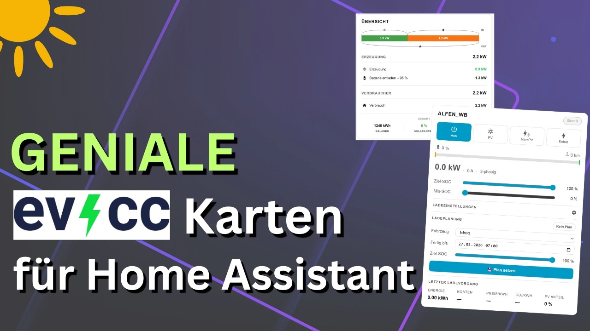
</a>
</td>
<td align="center">
<a href="https://www.youtube.com/watch?v=nQyiFg1RPy8">
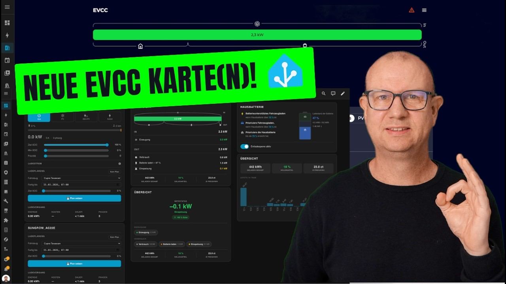
</a>
</td>
</tr>
</table>

[](https://smarterkram.de/9659/evcc-card-fuer-home-assistant/)

A detailed blog post about the card is available on [smarterkram.de](https://smarterkram.de/9659/evcc-card-fuer-home-assistant/) (German).

---

## License

[MIT](LICENSE)

---

## Related projects

- [EVCC](https://evcc.io/) - the EV charging controller this card is built for
- [ha-evcc](https://github.com/marq24/ha-evcc) - the Home Assistant integration providing all entities
